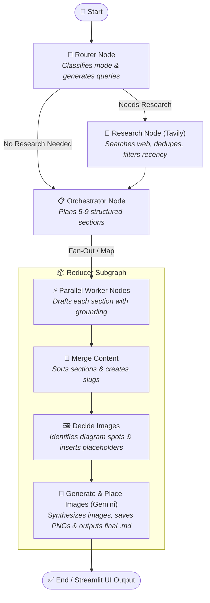

# ✍️ Autonomous Blog Writing AI Agent

[](https://blog-writing-ai-agent-04.streamlit.app)
[](https://github.com/langchain-ai/langgraph)
[](https://openai.com/)
[](https://ai.google.dev/)
[](https://www.python.org/)

An end-to-end autonomous, multi-agent technical blog writing system built using **LangGraph**, **LangChain**, **OpenAI GPT-4.1-mini**, **Google Gemini**, and **Tavily Web Search**, featuring a real-time **Streamlit** dashboard deployed on **Streamlit Cloud**.

The system automates the entire lifecycle of creating in-depth, well-structured technical blog posts: from topic analysis and real-time web research to parallel section drafting, automated diagram generation, and one-click packaging.

---

## 🌐 Live Deployments & Demo

| Service | Environment | URL | Status |
| :--- | :--- | :--- | :--- |
| **Interactive Blog Writing App** | Streamlit Cloud | [blog-writing-ai-agent-04.streamlit.app](https://blog-writing-ai-agent-04.streamlit.app) | 🟢 Live |

---

## 🌟 Key Features

- 🧠 **Dynamic Routing & Mode Selection**: Evaluates incoming topics to determine knowledge requirements:
  - `closed_book`: Evergreen technical topics (e.g., algorithms, data structures).
  - `hybrid`: Foundational concepts requiring contemporary tools and examples.
  - `open_book`: Fast-moving news, recents developments, and weekly roundups.
- 🔎 **Automated Web Research & Evidence Extraction**: Uses Tavily API to fetch current web articles, automatically deduplicating URLs, extracting concise snippets, and enforcing recency cutoffs relative to an as-of date.
- 📐 **Structured Outlining & Orchestration**: A Senior Technical Writer persona devises a comprehensive 5–9 section outline with explicit section goals, word targets, and key bullets.
- ⚡ **Parallel Worker Fan-Out (Map-Reduce)**: Leverages LangGraph `Send` API to parallelize writing across multiple worker agents, grounding each section in verified evidence.
- 🎨 **Multimodal Diagram Generation**: Automatically identifies where technical diagrams enhance reader comprehension, places markdown image placeholders, synthesizes diagrams using Google's **Gemini 2.5 Flash Image** model, and saves them locally.
- 🖥️ **Interactive Streamlit Web UI**:
  - Real-time graph execution tracker showing active nodes, state transitions, and log telemetry.
  - Multi-tab output viewer: Outline **Plan**, Scraped **Evidence**, Live **Preview** with embedded diagrams, and System **Logs**.
  - One-click export: Download standalone `.md` or complete zipped bundles (`.zip`) containing the article and all rendered images.
  - Past blog viewer: Quickly reload and browse previous generation runs.
- 📓 **Progressive Step-by-Step Notebooks**: Includes educational notebooks illustrating the incremental evolution from a basic LangGraph planner to full research and image synthesis.

---

## 🏗️ Architecture & Workflow

The core architecture follows a hierarchical multi-agent state graph with conditional branching, worker fan-out, and a nested reducer subgraph:



---

## 📂 Repository Structure

```plaintext
Blog-Writing-Agent/
├── bwa_frontend.py              # 🚀 Main application: Streamlit web interface
├── bwa_backend.py               # 🧠 Core LangGraph state graph, agent nodes & reducer subgraph
│
├── 1_bwa_basic.ipynb            # 📓 Step 1: Basic LangGraph Planner + Worker Fan-Out
├── 2_bwa_improved_prompting.ipynb # 📓 Step 2: Advanced personas, tone & structured constraints
├── 3_bwa_research.ipynb         # 📓 Step 3: Routing & Tavily web research integration
├── 5_bwa_image.ipynb            # 📓 Step 4: Image planning & Gemini visual synthesis
│
├── images/                      # 🖼️ Generated diagrams and illustrations organized by blog slug
│   └── <blog-slug>/
│       ├── diagram_1.png
│       └── ...
│
├── *.md                         # 📝 Generated sample blog posts (e.g. Transformers, Hash Tables, AI Trends)
├── requirements.txt             # 📦 Python project dependencies
└── .env                         # 🔑 API keys configuration file
```

---

## ⚙️ Prerequisites & Installation

### 1. Clone the Repository
```bash
git clone https://github.com/joel799659/Blog-Writing-AI-Agent.git
cd Blog-Writing-AI-Agent
```

### 2. Create and Activate a Virtual Environment
```bash
python3 -m venv myenv
source myenv/bin/activate   # On Windows: myenv\Scripts\activate
```

### 3. Install Dependencies
```bash
pip install -r requirements.txt
```

---

## 🔑 Environment Configuration

Create a `.env` file in the root directory and add your API keys:

```ini
# OpenAI API Key for GPT-4.1-mini (Text Generation, Planning, Routing, Worker writing)
OPENAI_API_KEY="your-openai-api-key"

# Tavily API Key for real-time web search and evidence collection
TAVILY_API_KEY="your-tavily-api-key"

# Google Gemini API Key for image/diagram synthesis (gemini-2.5-flash-image)
GOOGLE_API_KEY="your-google-api-key"
```

> [!TIP]
> If `TAVILY_API_KEY` is not provided, the agent will gracefully fall back to closed-book generation for all topics.

---

## 🚀 Running the Application

### 1. Launch the Streamlit Web Interface (Recommended)
Run the main application file:

```bash
streamlit run bwa_frontend.py
```

Open your browser at `http://localhost:8501`.

#### How to Use the UI:
1. **Enter Topic**: Input any technical topic, trend, or question into the sidebar text area.
2. **Select As-Of Date**: Specify the reference date for temporal freshness and recency filtering.
3. **Click "Generate Blog"**: Watch the live graph status track execution across nodes in real-time.
4. **Explore the Results**:
   - 🧩 **Plan**: Inspect section goals, word targets, and key bullets.
   - 🔎 **Evidence**: Review all verified web references, snippets, and source URLs.
   - 📝 **Preview**: Read the fully rendered markdown article with embedded diagrams.
   - 🧾 **Logs**: Monitor system events and structured node payloads.
5. **Download**: Click **Download Markdown** or **Download Bundle** (`.zip` containing the markdown and all synthesized images).
6. **Past Blogs**: Select and reload previously generated articles directly from the sidebar.

---

### 2. Running Programmatically via Python
You can also invoke the backend graph directly in Python:

```python
from datetime import date
from bwa_backend import app

inputs = {
    "topic": "Understanding Self-Attention in Transformer Architectures",
    "mode": "",
    "needs_research": False,
    "queries": [],
    "evidence": [],
    "plan": None,
    "as_of": date.today().isoformat(),
    "recency_days": 7,
    "sections": [],
    "merged_md": "",
    "md_with_placeholders": "",
    "image_specs": [],
    "blog_slug": "",
    "images_dir": "",
    "final": "",
}

output = app.invoke(inputs)
print(output["final"])
```

---

### 3. Step-by-Step Notebooks
For a guided walkthrough of how this multi-agent system was built:
- `1_bwa_basic.ipynb`: Basic state management and LangGraph fan-out.
- `2_bwa_improved_prompting.ipynb`: Persona engineering and structured schemas with Pydantic.
- `3_bwa_research.ipynb`: Adding Router logic, Tavily web queries, and recency filtering.
- `5_bwa_image.ipynb`: Diagram placeholder orchestration and Gemini image generation.

---

## 🛠️ Tech Stack

| Component | Technology | Purpose |
| :--- | :--- | :--- |
| **Agent Orchestration** | [LangGraph](https://github.com/langchain-ai/langgraph) | Graph state management, branching, fan-out, and reducer subgraphs |
| **LLM Framework** | [LangChain](https://github.com/langchain-ai/langchain) | Structured outputs, system prompts, message schemas |
| **Language Model** | OpenAI `gpt-4.1-mini` | Fast, accurate planning, routing, and section writing |
| **Search Engine** | [Tavily API](https://tavily.com/) | Real-time web retrieval tailored for LLM agents |
| **Image Generation** | Google Gemini `gemini-2.5-flash-image` (`google-genai`) | Automated technical diagram and visual asset synthesis |
| **Web Frontend** | [Streamlit](https://streamlit.io/) & [Streamlit Cloud](https://streamlit.io/cloud) | Interactive UI with real-time streaming updates and cloud hosting |
| **Data Validation** | [Pydantic v2](https://docs.pydantic.dev/) | Strict typing and structured outputs for plans, evidence, and image specs |

---

## 📄 License

This project is licensed under the [MIT License](LICENSE).
