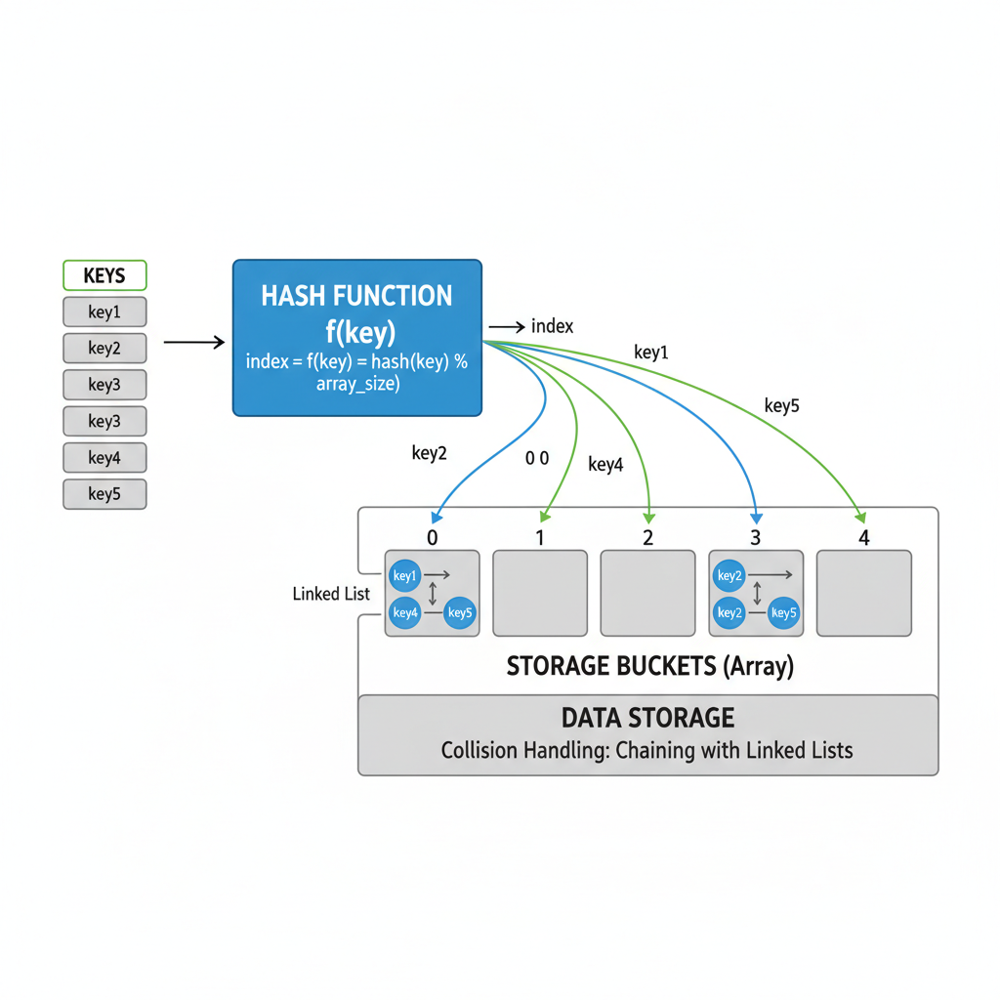
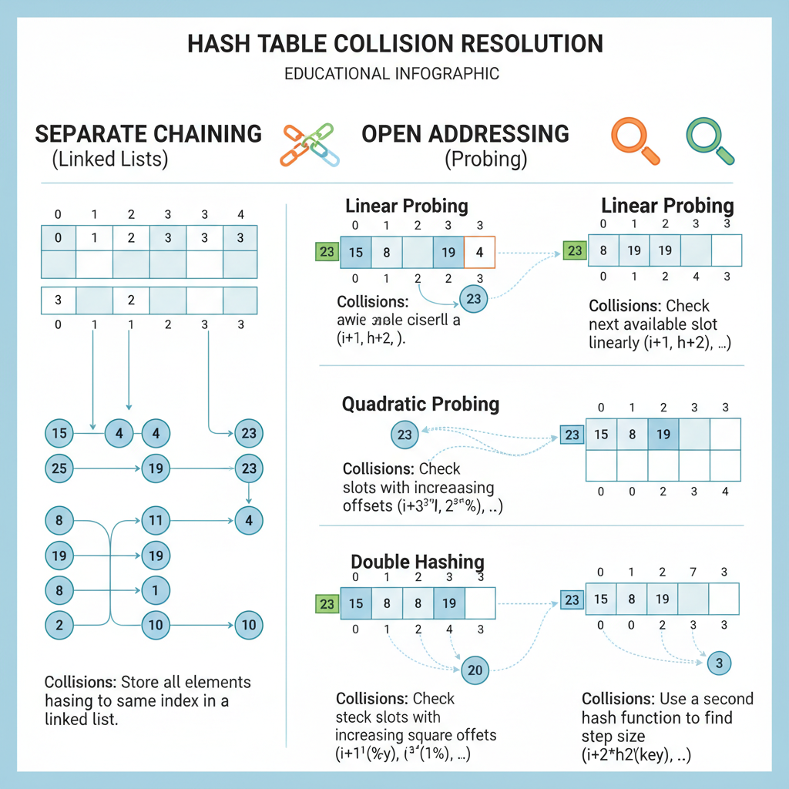

# How Hash Tables Work Internally

## Introduction to Hash Tables

A **hash table** is a fundamental data structure in computer science that stores key-value pairs, allowing for efficient data retrieval. It uses a hash function to compute an index into an array of buckets or slots, from which the desired value can be found quickly.

### What is a Hash Table?

At its core, a hash table maps keys to values. When you provide a key, the hash function processes it and returns an index where the corresponding value is stored. This approach enables near-constant time complexity (O(1)) for search, insertion, and deletion operations in average cases.

### Common Use Cases

Hash tables are widely used in various applications, including:

- **Databases:** For indexing and quick lookups.
- **Caching:** Storing frequently accessed data to improve performance.
- **Symbol Tables:** In compilers and interpreters to manage variable names and scopes.
- **Sets and Maps:** Implementing abstract data types that require fast membership tests.

### Importance of Efficient Data Retrieval

Efficient data retrieval is critical in software systems where speed and responsiveness matter. Hash tables provide a powerful solution by minimizing the time needed to access data, which is essential for:

- Handling large datasets.
- Supporting real-time applications.
- Reducing computational overhead in complex algorithms.

By understanding how hash tables work internally, developers can better appreciate their strengths and limitations, leading to more effective use in software design.

## Core Components of a Hash Table

A hash table is a data structure designed for efficient data retrieval, and it is composed of several key components that work together seamlessly:

- **Keys and Values**: At the heart of a hash table are the keys and values. The key is a unique identifier used to store and retrieve the corresponding value. Values can be any type of data associated with these keys. This key-value pairing allows for quick lookups based on the key.

- **Hash Function**: The hash function is a crucial element that transforms the key into an index. It takes the key as input and computes a numeric hash code, which determines where the value will be stored in the underlying storage structure. A good hash function distributes keys uniformly to minimize collisions and maintain efficient access times.

- **Storage Structure (Buckets/Arrays)**: Internally, hash tables use an array or a similar contiguous block of memory divided into slots called buckets. Each bucket can hold one or more key-value pairs. The hash function’s output directs the key-value pair to a specific bucket. When multiple keys hash to the same bucket (a collision), various strategies like chaining or open addressing are used to handle these collisions.

Together, these components enable hash tables to provide near-constant time complexity for insertion, deletion, and lookup operations, making them a fundamental tool in computer science.


*Core Components of a Hash Table*

## How Hash Functions Work

A hash function is a crucial component of a hash table, responsible for converting keys into indices that determine where the associated values are stored. The primary purpose of a hash function is to take an input (the key) and produce a fixed-size integer, called a hash code, which is then mapped to an index within the array that underlies the hash table.

### Purpose of a Hash Function

- **Efficient Data Retrieval:** By converting keys into array indices, hash functions enable constant-time average complexity (O(1)) for insertions, deletions, and lookups.
- **Uniform Distribution:** A good hash function distributes keys evenly across the array to minimize collisions, where two keys map to the same index.
- **Deterministic Output:** The same key must always produce the same hash code to ensure consistent access.

### Properties of a Good Hash Function

- **Deterministic:** Always returns the same index for the same key.
- **Uniformity:** Spreads keys evenly to avoid clustering and reduce collisions.
- **Fast Computation:** Should compute the hash code quickly to maintain overall performance.
- **Minimizes Collisions:** Although collisions are inevitable, a good hash function reduces their frequency.
- **Avalanche Effect:** Small changes in the input key should produce significantly different hash codes.

### Simple Examples of Hash Functions

1. **Modulo Hashing:**  
   For numeric keys, a simple hash function can be the key modulo the size of the array.  
   ```python
   def hash_function(key, array_size):
       return key % array_size
   ```
   This method is fast but may not distribute keys well if the keys have patterns.

2. **Sum of Character Codes:**  
   For string keys, summing the ASCII values of characters and then taking modulo can work.  
   ```python
   def hash_function(key, array_size):
       total = 0
       for char in key:
           total += ord(char)
       return total % array_size
   ```
   While simple, this can lead to collisions for anagrams or similar strings.

3. **Polynomial Rolling Hash:**  
   A more sophisticated approach for strings involves treating characters as coefficients in a polynomial, reducing collisions.  
   ```python
   def hash_function(key, array_size):
       p = 53  # a prime number roughly equal to the number of characters in the input alphabet
       m = 1_000_000_009  # a large prime number
       hash_value = 0
       p_pow = 1
       for char in key:
           hash_value = (hash_value + (ord(char) - ord('a') + 1) * p_pow) % m
           p_pow = (p_pow * p) % m
       return hash_value % array_size
   ```
   This method reduces collisions and is commonly used in practice.

In summary, hash functions transform keys into indices that allow hash tables to perform fast data operations. The choice of hash function impacts the efficiency and reliability of the hash table, making it a foundational concept in understanding how hash tables work internally.

## Handling Collisions

In hash tables, a **collision** occurs when two different keys produce the same hash value, causing them to map to the same index in the underlying array. Since each position in the array can typically hold only one entry, the hash table needs a strategy to handle these collisions to maintain efficient data retrieval.

### Common Collision Resolution Techniques

1. **Chaining**

   Chaining involves storing multiple elements at the same array index using a secondary data structure, usually a linked list. When a collision happens, the new key-value pair is simply appended to the list at that index.

   **Pros:**
   - Simple to implement.
   - Can handle a large number of collisions gracefully.
   - The hash table can dynamically grow without needing to resize immediately.

   **Cons:**
   - Requires additional memory for pointers in the linked list.
   - Lookup time can degrade to O(n) in the worst case if many keys collide at the same index.

2. **Open Addressing**

   Open addressing stores all elements directly within the array. When a collision occurs, the hash table probes the array using a predefined sequence (linear probing, quadratic probing, or double hashing) to find the next available slot.

   **Pros:**
   - No extra memory overhead for pointers.
   - Better cache performance due to data locality.
   
   **Cons:**
   - More complex insertion and search logic.
   - Performance degrades as the table becomes full, increasing probe lengths.
   - Requires careful resizing and rehashing to maintain efficiency.

Both methods aim to resolve collisions efficiently but differ in memory usage and performance characteristics. Choosing between chaining and open addressing depends on the specific use case, expected load factor, and performance requirements.


*Collision Handling Techniques in Hash Tables*

## Performance Considerations

When working with hash tables, understanding the factors that influence their performance is crucial for efficient data storage and retrieval. Several key aspects affect how well a hash table performs, including the load factor, resizing strategies, and best practices for maintenance.

### Load Factor and Its Impact

The **load factor** is the ratio of the number of stored elements to the total number of available buckets in the hash table. It essentially measures how full the hash table is. A high load factor means more elements per bucket on average, which increases the likelihood of collisions—situations where multiple keys hash to the same bucket.

- **Low load factor**: Reduces collisions, leading to faster lookups, insertions, and deletions.
- **High load factor**: Increases collisions, causing longer chains or probe sequences, which slows down operations.

Maintaining an optimal load factor (commonly around 0.7 to 0.75) balances memory usage and performance.

### Resizing and Rehashing

When the load factor exceeds a certain threshold, the hash table typically **resizes** to maintain performance. Resizing involves:

1. **Allocating a larger array** of buckets.
2. **Rehashing all existing keys** to redistribute them according to the new bucket count.

This process is computationally expensive but necessary to keep operations efficient over time. Some hash table implementations use prime numbers or powers of two for bucket sizes to optimize the distribution of keys during rehashing.

### Best Practices for Maintaining Performance

- **Choose an appropriate initial size**: If you know the approximate number of elements in advance, initializing the hash table with a suitable size can reduce the frequency of resizing.
- **Monitor and adjust the load factor threshold**: Depending on your application’s performance needs, tuning the load factor threshold can help balance speed and memory consumption.
- **Use good hash functions**: A well-designed hash function minimizes collisions by evenly distributing keys across buckets.
- **Avoid excessive resizing**: Frequent resizing can degrade performance; consider batch insertions or pre-sizing when dealing with large datasets.

By carefully managing these factors, you can ensure that your hash table remains efficient, providing fast access times and optimal resource utilization.

## Real-World Applications and Examples

Hash tables are fundamental data structures widely used in software development due to their ability to provide fast data access, insertion, and deletion. Here are some common applications where hash tables play a crucial role:

- **Caching**  
  Hash tables are often used to implement caches, where quick lookup of previously computed or retrieved data is essential. By storing cached results in a hash table keyed by input parameters or resource identifiers, applications can avoid expensive recomputations or network calls.  
  *Example:* A web application might cache user session data in a hash table, allowing constant-time retrieval based on session IDs.

- **Databases and Indexing**  
  Many database systems use hash tables to implement indexes for quick data retrieval. Hash-based indexing allows the database to locate records without scanning entire tables, significantly improving query performance.  
  *Example:* A hash index on a user ID column enables direct access to user records in constant time.

- **Sets and Membership Testing**  
  Hash tables are the backbone of set data structures, providing efficient membership tests. Checking if an element exists in a set can be done in average constant time, which is much faster than searching through lists or arrays.  
  *Example:* A spell checker might use a hash set of valid words to quickly verify if a given word is spelled correctly.

### How Hash Tables Improve Efficiency

In all these cases, hash tables improve efficiency primarily through their average-case constant time complexity (O(1)) for key-based operations. This efficiency comes from:

- **Direct Indexing:** Hash functions convert keys into indices, allowing immediate access to the corresponding data bucket.
- **Collision Handling:** Techniques like chaining or open addressing ensure that even when multiple keys hash to the same index, operations remain efficient.
- **Dynamic Resizing:** Many implementations resize the hash table when it becomes too full, maintaining performance by reducing collisions.

### Simple Pseudocode Example: Caching with a Hash Table

```pseudo
function getData(key):
    if cache.contains(key):
        return cache.get(key)  // Fast retrieval from hash table
    else:
        data = expensiveComputation(key)
        cache.put(key, data)   // Store result for future use
        return data
```

This pattern demonstrates how hash tables enable applications to avoid repeated expensive operations by quickly checking and retrieving cached results.

## Summary and Further Reading

In this article, we explored the internal workings of hash tables, focusing on how they use hash functions to map keys to indices in an array, handle collisions through methods like chaining and open addressing, and maintain efficient average-case performance for insertion, deletion, and lookup operations. Understanding these core concepts is essential for appreciating the balance between speed and memory usage that hash tables offer.

For those interested in deepening their knowledge, here are some recommended resources:

- **Books:**
  - *Introduction to Algorithms* by Cormen, Leiserson, Rivest, and Stein — Comprehensive coverage of data structures including hash tables.
  - *Algorithms* by Robert Sedgewick and Kevin Wayne — Offers clear explanations and practical implementations.

- **Articles and Tutorials:**
  - [Hash Tables - GeeksforGeeks](https://www.geeksforgeeks.org/hashing-data-structure/) — A detailed overview with examples.
  - [Hash Table Explained - freeCodeCamp](https://www.freecodecamp.org/news/hash-tables-explained/) — Beginner-friendly introduction.
  - [JavaScript Hash Tables - MDN Web Docs](https://developer.mozilla.org/en-US/docs/Web/JavaScript/Reference/Global_Objects/Map) — Practical usage in JavaScript.

- **Interactive Learning:**
  - Experiment with hash table implementations in your preferred programming language.
  - Use online coding platforms like LeetCode or HackerRank to solve problems involving hash tables.

By combining theoretical understanding with hands-on practice, you can master the use of hash tables and apply them effectively in your software projects.