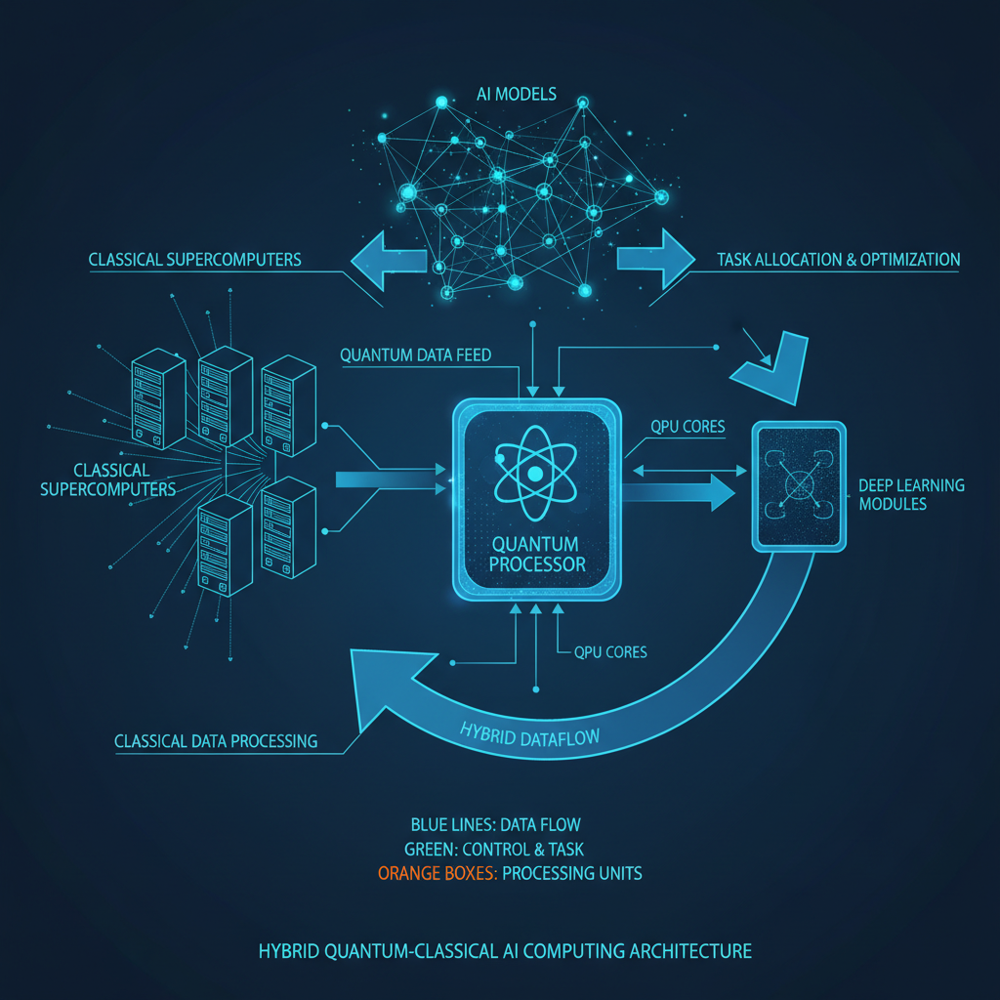
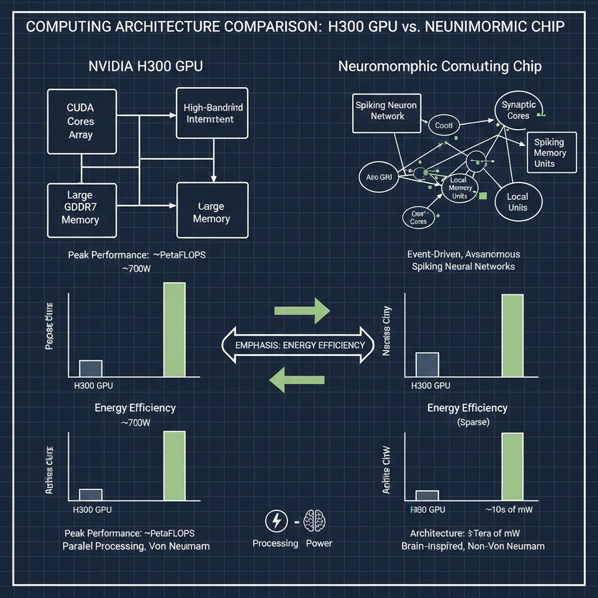

# Recent AI News and Trends in 2026

## Introduction to AI in 2026

Artificial Intelligence has undergone remarkable evolution leading up to 2026, transforming from niche research to a pervasive force reshaping industries, economies, and daily life. Over the past decade, advances in machine learning, natural language processing, and agentic AI systems have accelerated, enabling more autonomous, context-aware, and human-like capabilities.

The breakthroughs witnessed this year are particularly significant. Innovations in AI architectures, ethical frameworks, and real-world applications are pushing the boundaries of what machines can achieve. From enhanced decision-making tools to AI-driven creativity and personalized experiences, 2026 marks a pivotal moment where AI is not only more powerful but also more accessible and responsible.

For professionals and enthusiasts alike, staying updated on these developments is crucial. The rapid pace of change means that understanding emerging trends, challenges, and opportunities is essential to harness AI’s potential effectively and ethically. Whether you are a developer, business leader, or curious observer, keeping abreast of the latest AI news ensures you remain informed and prepared for the future this transformative technology is shaping.

## Quantum Computing and AI Integration

Quantum computing is rapidly emerging as a transformative force in the field of artificial intelligence, promising to significantly enhance AI capabilities beyond classical limits. At the heart of this advancement is the concept of **quantum advantage**, which refers to the point where quantum computers can solve problems faster or more efficiently than the best classical supercomputers. This is made possible by **logical qubits**, the fundamental units of quantum information that enable error-corrected, stable quantum computations.

One of the most exciting developments in 2026 is the rise of **hybrid computing architectures** that combine quantum processors, AI algorithms, and traditional supercomputers. These systems leverage the strengths of each technology: quantum computers handle complex optimization and pattern recognition tasks, AI models provide adaptive learning and decision-making, and supercomputers manage large-scale data processing. This synergy is opening new frontiers in tackling problems that were previously intractable.

The potential impacts of integrating quantum computing with AI are profound, particularly in scientific research and problem-solving. For example, quantum-enhanced AI can accelerate drug discovery by simulating molecular interactions at unprecedented precision, optimize logistics and supply chains with greater efficiency, and improve climate modeling to better predict and mitigate environmental changes. As these technologies continue to mature, they are set to redefine what is possible in AI-driven innovation and discovery.

*Hybrid computing architecture combining quantum processors, AI algorithms, and classical supercomputers for enhanced AI capabilities.*

## Breakthroughs in AI Hardware and Platforms

The rapid evolution of AI in 2026 is being driven not only by advances in algorithms but also by significant breakthroughs in AI hardware and platforms. These innovations are crucial for scaling AI models to unprecedented sizes while improving efficiency and performance.

One of the standout developments is **NVIDIA's Vera Rubin platform**, powered by the new **H300 GPUs**. This platform is designed to accelerate large-scale AI training and inference, leveraging advanced tensor cores and enhanced interconnects to boost throughput. The H300 GPUs incorporate cutting-edge architecture improvements that deliver higher performance per watt, enabling more sustainable AI workloads.

Alongside traditional GPU advancements, **neuromorphic computing** is gaining traction as a promising frontier. Neuromorphic chips mimic the brain’s neural architecture, offering ultra-low latency and energy-efficient processing for AI tasks. These chips are particularly effective for edge AI applications, where power constraints and real-time responsiveness are critical.

Together, these hardware innovations are transforming the AI landscape by significantly improving **energy efficiency** and **processing power**. This enables researchers and enterprises to train larger, more complex models faster and at lower operational costs, paving the way for more sophisticated AI applications across industries. As a result, the synergy between advanced GPUs like NVIDIA’s H300 and emerging neuromorphic technologies is setting new standards for scalable, efficient AI computing in 2026.

*Comparison of NVIDIA's H300 GPU architecture and neuromorphic computing chips highlighting performance and energy efficiency.*

## Agentic AI and Its Market Evolution

Agentic AI, characterized by autonomous decision-making capabilities and proactive problem-solving, has become a focal point of excitement and debate in 2026. This class of AI systems goes beyond traditional reactive models by initiating actions, setting goals, and adapting dynamically to complex environments, effectively acting as independent agents within workflows.

### The Hype Cycle of Agentic AI

The hype around agentic AI has surged as breakthroughs in reinforcement learning, natural language understanding, and multi-modal reasoning have enabled more sophisticated autonomous behaviors. Early 2026 saw a peak in expectations, fueled by high-profile demonstrations of agentic systems managing end-to-end business processes with minimal human oversight. However, industry experts caution that we are still navigating the "peak of inflated expectations," with challenges around reliability, ethical governance, and interpretability tempering enthusiasm.

### Predicted Trajectory and Business Adoption

Looking ahead, agentic AI is predicted to enter a phase of more pragmatic adoption, moving from experimental pilots to scaled deployments in sectors such as finance, supply chain management, and customer service. Businesses are increasingly investing in agentic AI to enhance operational efficiency, reduce human error, and enable 24/7 autonomous operations. The trajectory suggests a gradual maturation over the next 3-5 years, with improvements in transparency and control mechanisms critical to widespread trust and regulatory acceptance.

### Examples of Agentic AI in Enterprise Workflows

- **Financial Services:** Autonomous trading agents that monitor markets, execute trades, and adjust strategies in real-time without human intervention.
- **Supply Chain:** Intelligent logistics coordinators that dynamically reroute shipments, manage inventory levels, and negotiate with suppliers based on changing conditions.
- **Customer Support:** Virtual agents capable of handling complex multi-turn conversations, escalating issues only when necessary, and learning from interactions to improve service quality.

In summary, while agentic AI remains a technology in evolution, its potential to transform enterprise workflows is undeniable. The coming years will be pivotal in balancing innovation with responsible deployment to fully realize the benefits of autonomous AI agents.

## AI in Scientific Research and Discovery

Artificial intelligence is rapidly reshaping the landscape of scientific research, acting not just as a tool but increasingly as an active collaborator in the discovery process. In 2026, AI systems are generating novel hypotheses, designing and optimizing experiments, and accelerating workflows across a variety of scientific domains.

One of the most transformative impacts of AI is its ability to analyze vast datasets and identify patterns that might elude human researchers. This capability is proving invaluable in complex fields such as climate modeling, where AI helps simulate and predict environmental changes with unprecedented precision. Similarly, in molecular dynamics and biology, AI-driven models are enabling deeper insights into protein folding, drug interactions, and genetic mechanisms, thereby speeding up the path from theory to practical applications.

Looking ahead, the role of AI is expected to evolve from a supportive assistant to a proactive research partner. This means AI won’t just execute predefined tasks but will actively propose new research directions, adapt experiments in real time, and collaborate with human scientists to push the boundaries of knowledge. Such agentic AI systems promise to make scientific workflows more efficient, creative, and impactful, heralding a new era of accelerated discovery.

## Open-Source AI and Model Diversification

The AI landscape in 2026 is witnessing a significant shift driven by the rise of open-source AI models and a growing emphasis on model diversification. This trend is reshaping the ecosystem in several key ways:

- **Shift Towards Smaller, Efficient, Domain-Specific Models**  
  Instead of relying solely on massive, generalized models, developers and organizations are increasingly adopting smaller, more efficient models tailored to specific domains or tasks. These models offer faster deployment, lower computational costs, and improved performance in specialized applications. This shift enables broader accessibility and innovation, especially for startups and research groups with limited resources.

- **Global Diversification Including Chinese Multilingual Models**  
  The AI model landscape is becoming more geographically and linguistically diverse. Notably, Chinese multilingual models are gaining prominence, reflecting the global demand for AI systems that understand and generate content across multiple languages and cultural contexts. This diversification fosters a more inclusive AI ecosystem that better serves a worldwide user base.

- **Importance of Interoperability and Governance**  
  As the number and variety of open-source models grow, ensuring interoperability between different AI systems becomes critical. Standards and frameworks that facilitate seamless integration and collaboration across models are essential for maximizing their utility. Additionally, governance mechanisms are increasingly important to address ethical considerations, data privacy, and responsible AI use, helping to build trust and accountability in an open-source environment.

Overall, the rise of open-source AI and diversified models is democratizing AI development, encouraging innovation, and promoting a more resilient and adaptable AI ecosystem. This trend aligns with broader industry observations and predictions highlighted in leading AI research and news sources throughout 2026.

## AI’s Role in Innovation and Workflow Orchestration

In 2026, AI is rapidly evolving from being mere individual productivity tools into dynamic engines of team collaboration and process orchestration. No longer confined to passive assistance, AI systems are becoming active collaborators that anticipate needs, identify potential problems, and drive innovation across entire workflows.

### From Passive Assistants to Active Collaborators

Traditionally, AI tools served as reactive helpers—responding to user commands or automating simple tasks. Today, AI agents proactively engage with teams by understanding context, suggesting next steps, and even initiating actions without explicit prompts. This shift enables smoother coordination among team members and reduces bottlenecks in complex projects.

### AI Anticipating Needs and Problem-Solving

Modern AI platforms leverage advanced predictive analytics and natural language understanding to foresee challenges before they arise. By analyzing historical data and real-time inputs, AI can recommend resource allocation, flag risks, and optimize schedules. This anticipatory capability transforms AI from a tool that reacts to one that strategically guides decision-making.

### Examples of AI Transforming Workflows and Decision-Making

- **Cross-functional Collaboration:** AI-driven platforms now integrate data from diverse departments, enabling seamless communication and unified project tracking. For example, AI can automatically align marketing campaigns with product development timelines, ensuring synchronized launches.

- **Automated Decision Support:** In industries like finance and healthcare, AI systems analyze vast datasets to provide actionable insights, helping teams make faster, more informed decisions while reducing human error.

- **Innovation Acceleration:** AI-powered ideation tools assist teams by generating creative solutions and simulating outcomes, fostering a culture of continuous innovation.

As highlighted in recent reports from Microsoft, IBM, and MIT Sloan Review, these advancements mark a fundamental transformation in how organizations leverage AI—not just to enhance individual productivity but to orchestrate complex workflows and drive collective success.

## Regulatory and Market Challenges in AI

As AI technologies continue to advance rapidly in 2026, they face increasing scrutiny from regulators and evolving market dynamics that significantly shape their deployment. Several key challenges are emerging around governance, legal frameworks, and market access:

- **State-Level AI Regulations, Especially in Healthcare**  
  Governments are introducing more granular regulations targeting AI applications, with healthcare being a primary focus due to patient safety and privacy concerns. States are crafting specific rules around AI diagnostics, treatment recommendations, and data handling, creating a patchwork of compliance requirements that companies must navigate. This fragmentation complicates scaling AI solutions nationally and demands robust legal and ethical oversight.

- **Governance Clashes and Vendor Diversification**  
  As AI systems become more integral to critical operations, governance conflicts arise between regulators, vendors, and users over accountability, transparency, and control. Organizations are increasingly diversifying their AI vendors to mitigate risks associated with over-reliance on a single provider and to comply with varied regulatory demands. This diversification drives innovation but also adds complexity in integration and standardization.

- **Impact on Startups and Large Tech Companies**  
  Regulatory burdens and market access challenges disproportionately affect startups, which often lack the resources to meet stringent compliance requirements compared to large tech firms. However, startups benefit from agility and niche specialization, enabling them to innovate within constrained environments. Large companies leverage their scale and legal teams to influence policy and navigate regulations but face pressure to maintain ethical standards and public trust amid growing scrutiny.

Together, these regulatory and market challenges are shaping a more cautious but strategically diverse AI ecosystem in 2026, emphasizing responsible innovation and adaptive governance.

## Conclusion and Looking Ahead

As we reflect on the AI landscape in 2026, several major trends and breakthroughs stand out. Agentic AI systems are becoming more autonomous and capable, while advances in multimodal learning and foundation models continue to push the boundaries of what AI can achieve. Ethical considerations and responsible AI development remain central, ensuring technology benefits society broadly. Additionally, AI’s integration into industries—from healthcare to finance—is accelerating, driving innovation and operational efficiency.

For businesses, researchers, and users alike, these developments imply a need to embrace AI not just as a tool but as a strategic partner. Organizations must invest in building “change fitness” to adapt rapidly to evolving AI capabilities and balance trade-offs between automation and human oversight. Researchers are challenged to deepen understanding of AI’s societal impacts, while users should stay informed to leverage AI safely and effectively.

Looking ahead, staying adaptive and continuously learning will be crucial. The AI journey in 2026 and beyond promises exciting opportunities and complex challenges. By remaining engaged with the latest trends and fostering collaboration across sectors, we can shape an AI-powered future that is innovative, inclusive, and responsible.
