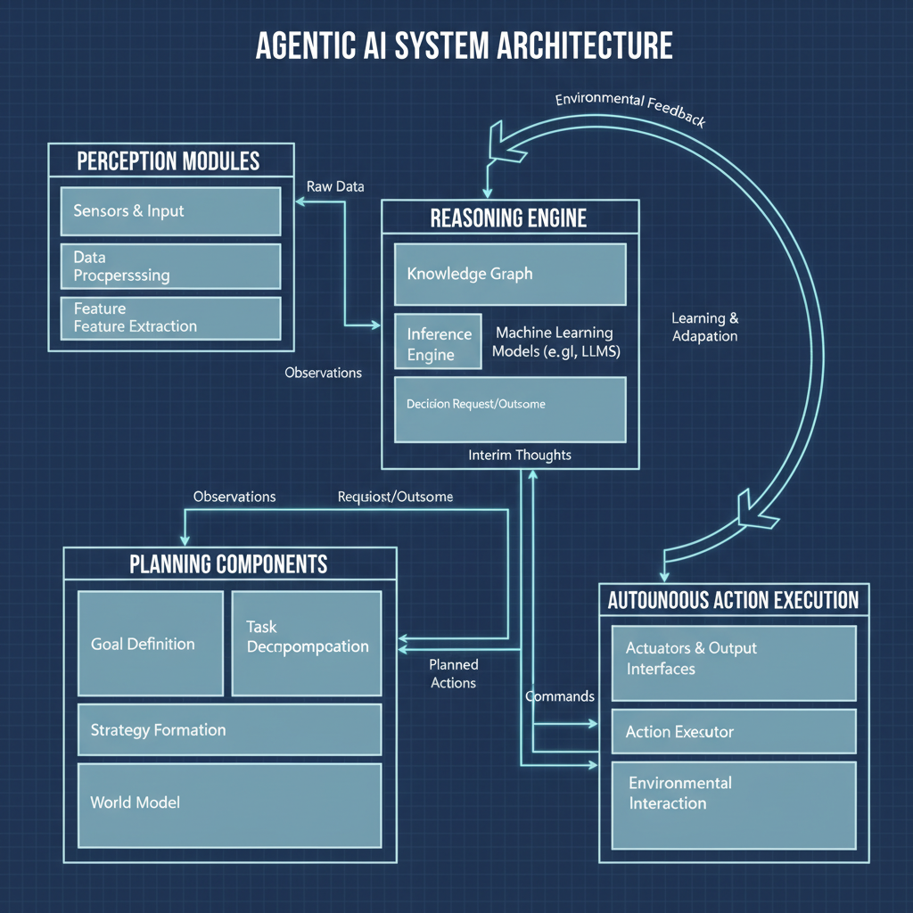
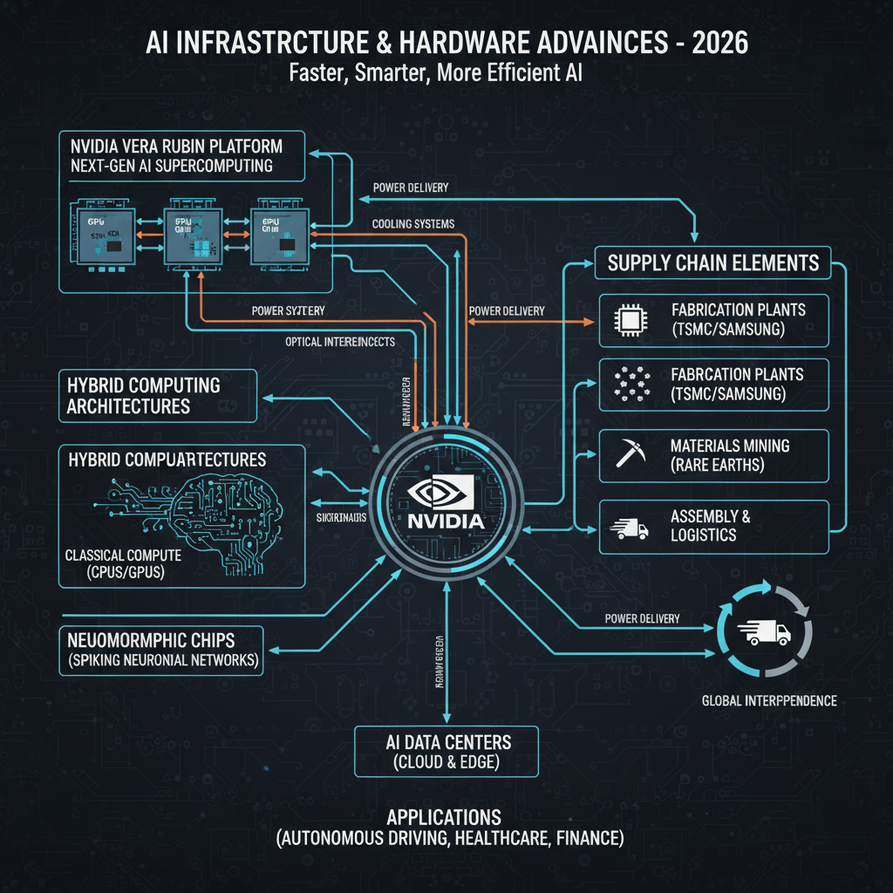
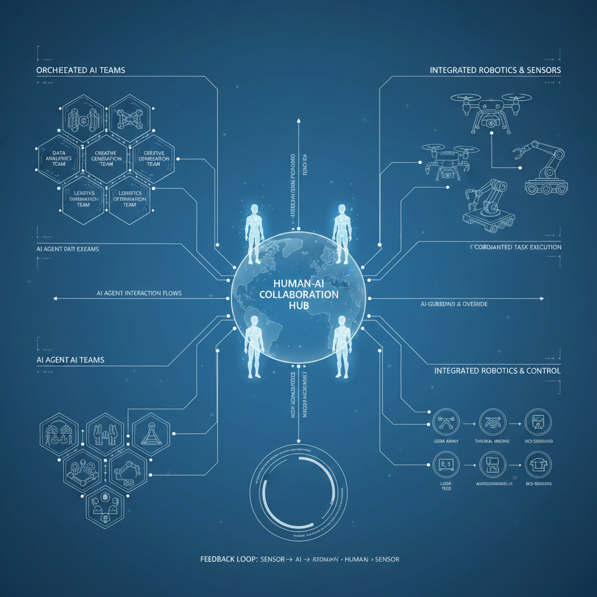

# Recent AI News: Key Developments and Trends in 2026

## Introduction to AI in 2026

The year 2026 marks a pivotal moment in the evolution of artificial intelligence, characterized by rapid technological advancements that continue to reshape how we live and work. AI systems have become more sophisticated, capable of performing complex tasks with greater autonomy and efficiency than ever before. This progress is not limited to a single domain; industries ranging from healthcare and finance to manufacturing and entertainment are increasingly integrating AI to drive innovation, optimize operations, and enhance user experiences.

A defining theme for AI in 2026 is the rise of **agentic AI**—intelligent systems that possess a degree of autonomy and decision-making capability, enabling them to act proactively in dynamic environments. Unlike traditional AI models that respond passively to inputs, agentic AI can set goals, adapt strategies, and execute actions independently, opening new possibilities for automation and problem-solving.

As AI continues to advance, understanding these trends and their implications is essential for businesses, policymakers, and society at large. The developments in agentic AI, alongside ongoing breakthroughs, signal a transformative era where AI not only supports human activities but also takes on a more active, collaborative role.

## Agentic AI: The Rise of Autonomous Systems

Agentic AI represents a transformative leap in artificial intelligence, characterized by systems that can independently perceive, reason, and act to achieve complex goals without continuous human intervention. Unlike traditional AI models that require explicit instructions or human oversight, agentic AI exhibits autonomy, adaptability, and decision-making capabilities akin to intelligent agents.

### What is Agentic AI?

At its core, agentic AI refers to autonomous systems designed to operate with a high degree of self-governance. These systems can:

- Interpret and respond to dynamic environments
- Plan and execute multi-step tasks
- Learn from experience to improve performance over time
- Collaborate or interact with humans and other AI agents seamlessly

This autonomy enables agentic AI to handle complex workflows and real-world challenges that were previously infeasible for automated systems.

### Examples of Agentic AI in 2026

The year 2026 has seen remarkable advancements in agentic AI, with tangible applications emerging across industries:

- **Humanoid Robots:** These robots combine sophisticated perception, natural language understanding, and motor skills to perform tasks ranging from customer service to healthcare assistance. Their agentic nature allows them to adapt to unpredictable human environments.
- **Autonomous Workflows:** In enterprise settings, agentic AI orchestrates end-to-end processes such as supply chain management, financial analysis, and software development, reducing the need for manual oversight and accelerating decision-making.

### Leading Products Driving the Agentic AI Revolution

Several key products exemplify the breakthroughs in agentic AI this year:

- **NVIDIA’s Vera Rubin:** A cutting-edge AI platform that integrates advanced perception and reasoning modules, enabling robots and autonomous systems to operate reliably in complex, real-world scenarios.
- **Google’s Gemma 4:** An advanced autonomous agent designed to manage intricate workflows and provide proactive assistance across various domains, from personal productivity to large-scale business operations.

These innovations mark agentic AI as a breakthrough in 2026, signaling a shift toward truly autonomous intelligent systems that can augment human capabilities and transform industries.

*Architecture and capabilities of agentic AI systems*

## Top AI Models and Tools Shaping 2026

The AI landscape in 2026 is being defined by several groundbreaking models and tools that are pushing the boundaries of innovation across industries. Here’s a look at some of the most prominent AI models and the unique capabilities they bring to the table:

- **OpenAI Sora 2**  
  Building on its predecessor’s success, Sora 2 excels in multi-modal understanding and generation, seamlessly integrating text, images, and audio. This model is widely adopted for creative content generation, advanced conversational agents, and real-time language translation, making it a versatile choice for both consumer-facing applications and enterprise solutions.

- **Google Gemini 2.5 Pro**  
  Gemini 2.5 Pro focuses on agentic AI capabilities, enabling autonomous decision-making and complex task execution. Its strength lies in adaptive learning and contextual reasoning, which makes it ideal for scientific research, automated data analysis, and dynamic business process optimization. Gemini’s integration with Google’s cloud ecosystem also enhances scalability and deployment flexibility.

- **Anthropic Claude 4.5 Sonnet**  
  Known for its emphasis on safety and interpretability, Claude 4.5 Sonnet offers robust natural language understanding with a strong ethical framework. It is particularly favored in sensitive domains such as healthcare, legal advisory, and compliance monitoring, where transparency and reliability are paramount.

In addition to these models, several AI tools are gaining traction for their support in scientific research and enterprise applications:

- **AI-driven Research Platforms** like Crescendo.ai enable accelerated hypothesis testing and data synthesis, significantly reducing the time from discovery to publication.  
- **Enterprise AI Suites** integrate advanced analytics, predictive modeling, and automation workflows to enhance decision-making and operational efficiency across sectors such as finance, manufacturing, and supply chain management.

Together, these models and tools illustrate the diverse and rapidly evolving AI ecosystem in 2026, where innovation is driven by both technical sophistication and practical applicability.

## AI Infrastructure and Hardware Advances

The rapid evolution of AI in 2026 is underpinned by significant advancements in the technological infrastructure and hardware that support increasingly complex models and applications. One standout development is NVIDIA’s Vera Rubin platform, which exemplifies the next generation of AI computing environments. Vera Rubin integrates massive parallel processing capabilities with optimized AI frameworks, enabling faster training and inference for large-scale models while improving energy efficiency.

Beyond traditional GPU-based platforms, neuromorphic computing has gained traction as a promising approach to mimic the brain’s neural architecture. By leveraging spiking neural networks and event-driven processing, neuromorphic chips offer ultra-low power consumption and real-time learning capabilities, making them ideal for edge AI and autonomous systems. Hybrid computing architectures that combine neuromorphic elements with classical processors are also emerging, providing flexible and efficient solutions tailored to diverse AI workloads.

On the supply chain front, 2026 has seen notable shifts driven by geopolitical factors and increased demand for specialized AI hardware. Companies are investing heavily in domestic semiconductor manufacturing and diversifying suppliers to mitigate risks. Capital expenditures in AI hardware have surged, focusing on expanding data center capacity and developing custom AI accelerators. These investments are crucial to sustaining the growth of AI applications across industries and ensuring the infrastructure can keep pace with innovation.

*Overview of AI infrastructure and hardware advances in 2026*

## Security and Governance in AI

As AI technologies advance rapidly in 2026, security and governance have become critical focal points to ensure safe, ethical, and compliant deployment. New challenges arise from increasingly autonomous AI agents capable of making complex decisions, demanding robust frameworks and innovative solutions.

### Emerging Security Platforms

One notable development is Palo Alto Networks' Prisma AIRS 3.0, a next-generation security platform designed specifically to protect AI environments. Prisma AIRS 3.0 integrates advanced threat detection tailored for AI workloads, safeguarding data integrity and model confidentiality across cloud and edge deployments. This platform exemplifies how cybersecurity is evolving to address AI-specific vulnerabilities such as model poisoning, adversarial attacks, and data leakage.

### Regulatory Developments Across Regions

Governments worldwide are accelerating the creation of AI regulations, with particular attention to sensitive sectors like healthcare. In the European Union, updated AI Act provisions emphasize transparency, risk management, and human oversight, especially for AI systems impacting patient care. Meanwhile, the United States is advancing sector-specific guidelines that balance innovation with privacy and safety concerns. Asia-Pacific countries are also introducing frameworks that encourage responsible AI adoption while fostering regional competitiveness. These regulatory efforts collectively aim to harmonize standards and mitigate risks associated with AI deployment.

### Ethical Frameworks and Autonomous Decision-Making

As AI agents gain autonomy, ethical considerations become paramount. Organizations are increasingly adopting comprehensive ethical frameworks that guide AI behavior, focusing on fairness, accountability, and transparency. These frameworks address dilemmas posed by autonomous decision-making, such as bias mitigation and the delegation of critical judgments to machines. The integration of explainability tools and continuous monitoring helps ensure AI systems align with societal values and legal requirements. This ethical governance is essential to build trust and prevent misuse in applications ranging from finance to public safety.

In summary, 2026 marks a pivotal year where AI security platforms, evolving regulations, and ethical governance converge to shape a safer and more responsible AI landscape. Staying informed about these developments is crucial for stakeholders aiming to harness AI’s potential while managing its risks effectively.

## AI Trends Impacting Business and Society

In 2026, AI continues to reshape both business strategies and societal interactions in profound ways. One of the most notable shifts is how AI is enhancing the value of human judgment and relationships rather than replacing them. Businesses are increasingly leveraging AI to augment decision-making processes, allowing human intuition, creativity, and emotional intelligence to drive competitive advantage. This trend marks a move away from purely data-driven automation toward a more nuanced collaboration between humans and machines, where AI handles routine analysis and humans focus on strategic thinking and relationship-building.

At the same time, AI-driven automation is transforming the workforce landscape. While some sectors experience layoffs due to automation of repetitive tasks, new roles are emerging that require advanced skills in AI oversight, ethics, and system integration. This dual effect underscores the importance of workforce reskilling and adaptive business models that can balance efficiency gains with social responsibility. Companies that invest in “change fitness” — the ability to rapidly adapt to AI-driven disruptions — are better positioned to navigate these workforce transitions.

Moreover, AI is increasingly recognized as a collaborative tool in research and enterprise environments. Agentic AI systems, which can autonomously pursue goals and interact dynamically with humans, are accelerating innovation by handling complex data synthesis, hypothesis generation, and iterative experimentation. This collaboration enhances productivity and creativity, enabling organizations to tackle challenges that were previously out of reach. As a result, AI is not just a tool for automation but a partner in discovery and strategic growth, fostering new forms of human-machine synergy across industries and society at large.

## Future Outlook: What to Expect Beyond 2026

As we look beyond 2026, the trajectory of AI development promises transformative advancements that will reshape how humans and machines collaborate. Several key trends and research goals are driving this evolution:

- **Recursive Self-Improvement and Near AGI**  
  Researchers continue to push towards recursive self-improvement—AI systems capable of iteratively enhancing their own architectures and algorithms. This progress is expected to bring us closer to Artificial General Intelligence (AGI), where machines can perform a wide range of intellectual tasks at or beyond human levels. Achieving near AGI will mark a pivotal milestone, enabling AI to adapt flexibly across diverse domains without extensive retraining.

- **AI Agents as Digital Colleagues and Orchestrated Teams**  
  The role of AI agents is evolving from isolated tools to integrated digital colleagues. Future AI systems will operate as orchestrated teams, collaborating seamlessly with humans and other AI agents to solve complex problems. This shift will enhance productivity and creativity, as AI agents take on complementary roles—handling routine tasks, providing insights, and supporting decision-making in real time.

- **Integration of AI with Robotics and Sensor Technologies**  
  Emerging technologies are increasingly blending AI with robotics and advanced sensors, creating intelligent physical systems capable of perceiving and interacting with the world autonomously. This integration will accelerate innovations in areas such as autonomous vehicles, smart manufacturing, healthcare robotics, and environmental monitoring, enabling AI to extend its impact beyond digital environments into the physical realm.

*Future outlook on AI agents as digital colleagues and integration with robotics and sensors*

Together, these developments suggest a future where AI not only augments human capabilities but also becomes an indispensable partner in everyday life and work. Staying informed and adaptable will be crucial as these technologies continue to evolve rapidly.