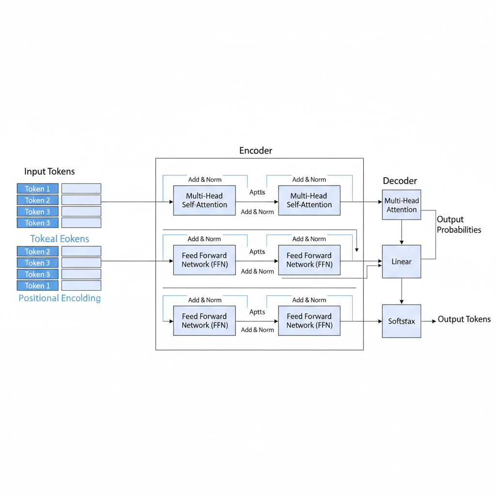
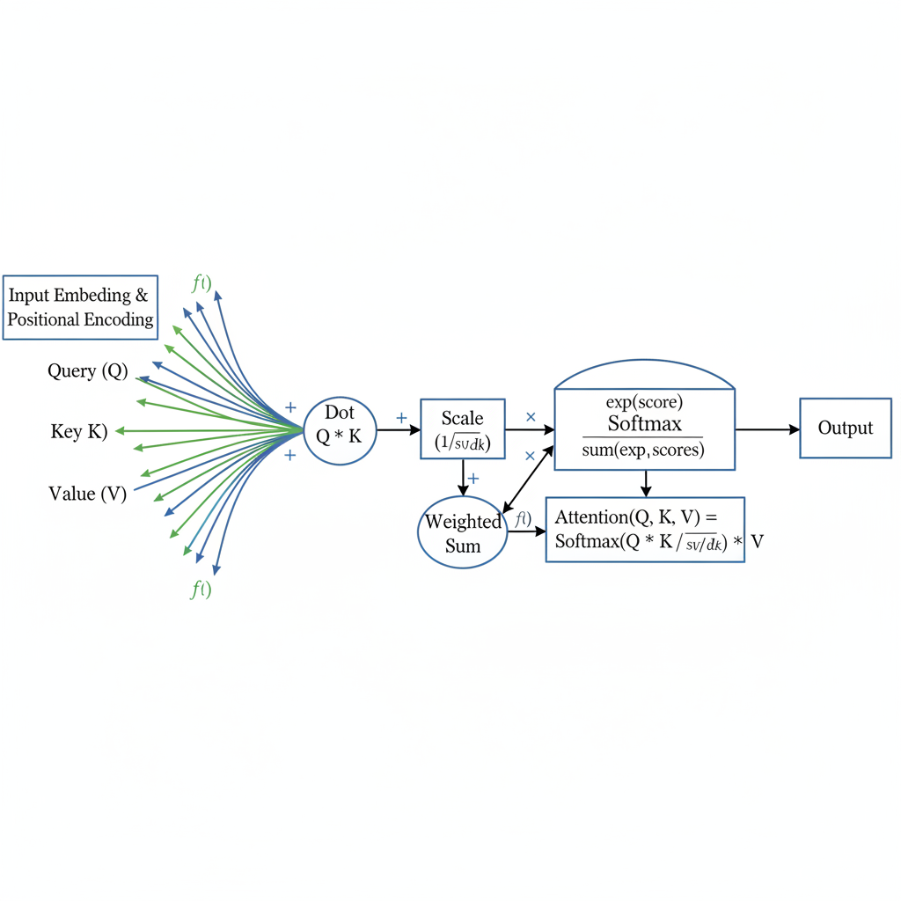
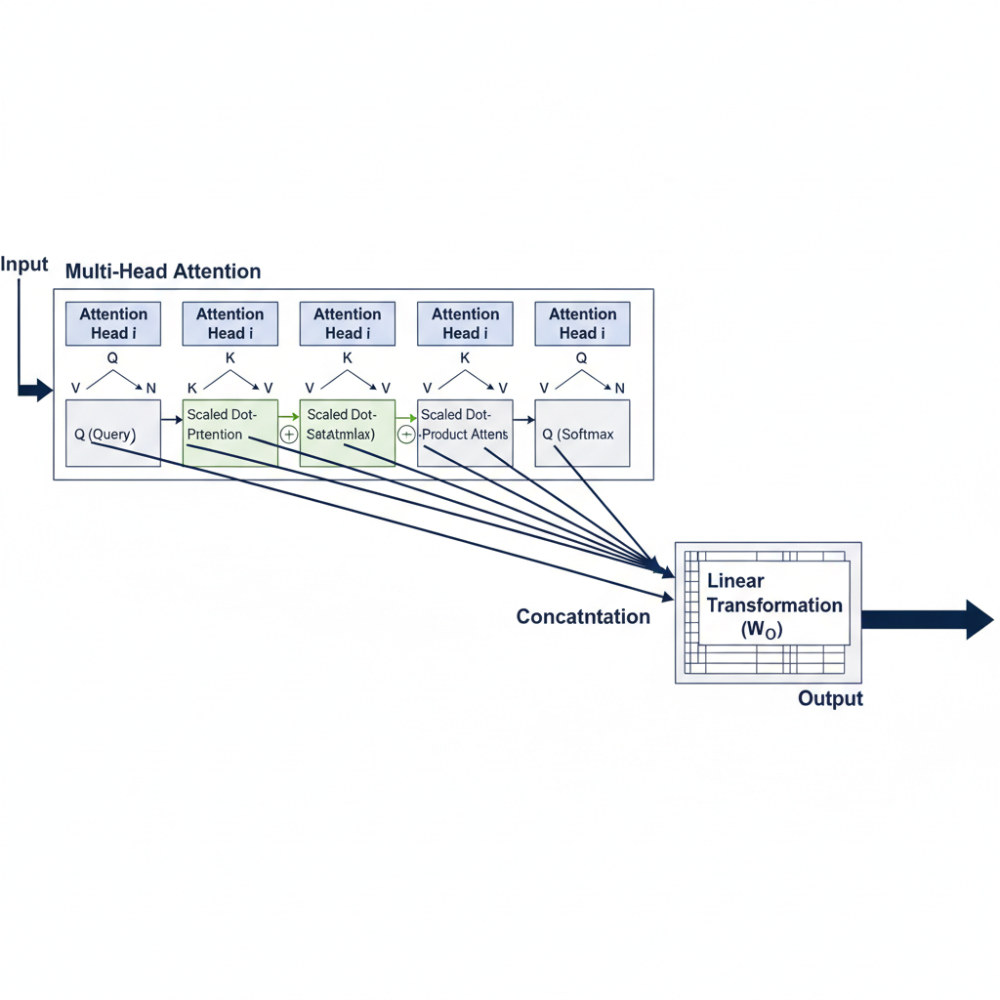

# Understanding Self-Attention in Transformer Architectures

## Introduction to Transformer Architecture

Transformer models, introduced in the seminal paper *“Attention Is All You Need”* (Vaswani et al., 2017), revolutionized the field of artificial intelligence by providing a novel approach to sequence modeling. Unlike traditional architectures such as Recurrent Neural Networks (RNNs) and Long Short-Term Memory networks (LSTMs), which process data sequentially and often struggle with long-range dependencies, Transformers rely on a mechanism called **self-attention** to capture relationships across an entire input sequence simultaneously.

### Origin and Motivation

The motivation behind Transformers was to overcome the limitations of RNNs and LSTMs, particularly their inefficiency in parallel computation and difficulty in modeling long-term dependencies. By leveraging self-attention, Transformers can weigh the importance of different parts of the input data dynamically, enabling more effective context understanding without relying on recurrent structures.

### Key Differences from RNNs and LSTMs

- **Parallelization:** Transformers process all tokens in a sequence at once, allowing for significantly faster training compared to the step-by-step processing in RNNs/LSTMs.
- **Long-Range Dependency Handling:** Self-attention enables direct connections between distant tokens, improving the model’s ability to capture global context.
- **Simplified Architecture:** Transformers eliminate the need for recurrence and convolution, relying instead on attention mechanisms and feed-forward layers.

### Role of Self-Attention

At the heart of the Transformer architecture lies the self-attention mechanism. It computes a weighted representation of the input sequence by comparing each token to every other token, effectively allowing the model to focus on relevant parts of the sequence when encoding or decoding information. This dynamic weighting is what empowers Transformers to excel in understanding complex patterns in data.

### Applications in Language and Vision

Transformers have become foundational in numerous AI applications:

- **Natural Language Processing (NLP):** Models like BERT, GPT, and T5 utilize Transformers for tasks such as language modeling, translation, summarization, and question answering.
- **Computer Vision:** Vision Transformers (ViTs) adapt the self-attention mechanism to image data, achieving state-of-the-art results in image classification and object detection.

The Transformer architecture’s flexibility and power continue to drive advancements across AI domains, making it a cornerstone of modern machine learning research and applications.

*Overview of Transformer architecture highlighting the role of self-attention.*

## What is Self-Attention?

Self-attention is a fundamental mechanism in transformer architectures that allows a model to weigh the importance of different tokens within the same input sequence when encoding or processing information. Unlike traditional sequential models that process tokens one by one, self-attention enables the model to consider all tokens simultaneously, capturing contextual relationships efficiently.

### Core Components: Queries, Keys, and Values

At the heart of self-attention are three vectors derived from each token’s embedding:

- **Query (Q):** Represents the token seeking information.
- **Key (K):** Represents the token being attended to.
- **Value (V):** Contains the actual information of the token.

Each token generates its own Q, K, and V vectors by multiplying its embedding with learned weight matrices. These vectors are used to compute attention scores that determine how much focus each token should give to others.

### How Tokens Attend to Each Other

Self-attention works by comparing the query vector of a token with the key vectors of all tokens in the sequence, including itself. This comparison produces a set of attention scores that quantify the relevance of each token to the query token. These scores are then normalized (usually via a softmax function) to form attention weights, which are used to compute a weighted sum of the value vectors. This weighted sum becomes the new representation of the token, enriched with contextual information from the entire sequence.

### Mathematical Formulation

Given an input sequence of token embeddings arranged in a matrix **X**, self-attention can be summarized as:

1. Compute queries, keys, and values:
   - Q = X × W_Q
   - K = X × W_K
   - V = X × W_V

2. Calculate attention scores by taking the dot product of queries and keys, scaled by the square root of the key dimension (to stabilize gradients):
   - Scores = Q × Kᵀ / √d_k

3. Apply softmax to obtain attention weights:
   - Attention = softmax(Scores)

4. Compute the output as the weighted sum of values:
   - Output = Attention × V

This process allows each token to dynamically aggregate information from all other tokens based on learned relevance.

### Parallelization Advantage

One of the key strengths of self-attention over traditional sequential models (like RNNs) is its ability to process all tokens simultaneously. Because the attention scores are computed via matrix multiplications, the entire sequence can be handled in parallel, significantly speeding up training and inference. This parallelism, combined with the capacity to model long-range dependencies directly, is a major reason why transformers have revolutionized natural language processing and other sequence modeling tasks.

*Detailed illustration of the self-attention mechanism including Q, K, V vectors and attention score computation.*

## Multi-Head Self-Attention Explained

Multi-head self-attention is a core innovation in transformer architectures that significantly enhances their ability to understand complex data relationships. Instead of relying on a single attention mechanism, transformers employ multiple attention heads running in parallel. Each head independently learns to focus on different parts of the input sequence, capturing a variety of relationships simultaneously.

### Parallel Attention Heads

In multi-head attention, the model projects the input embeddings into multiple sets of queries, keys, and values. Each set corresponds to one attention head. These heads operate concurrently, allowing the model to attend to information from different representation subspaces at various positions. This parallelism enables the model to capture diverse aspects of the data that a single attention head might miss.

### Capturing Different Relationships

Each attention head specializes in detecting distinct types of relationships within the input. For example, some heads may focus on syntactic structures such as word order and grammatical dependencies, while others capture semantic relationships like topic relevance or entity associations. This division of labor enriches the model’s understanding by providing multiple perspectives on the input.

### Combining Outputs

After each head computes its attention output, the results are concatenated and passed through a linear transformation to produce the final output of the multi-head attention layer. This combination integrates the diverse information captured by each head into a unified representation that the model can use for downstream tasks.

### Benefits of Multi-Head Attention

- **Richer Representations:** By attending to different parts of the input in parallel, the model builds more nuanced and comprehensive embeddings.
- **Improved Learning:** Multiple heads help the model generalize better by capturing complementary information, reducing the risk of missing important patterns.
- **Enhanced Performance:** Empirically, multi-head attention has been shown to improve the accuracy and robustness of transformer-based models across various natural language processing tasks.

In summary, multi-head self-attention allows transformers to process information from multiple angles simultaneously, leading to richer feature extraction and more effective learning. This mechanism is a key factor behind the success of transformer architectures in modern AI applications.

*Illustration of multi-head self-attention with multiple parallel attention heads and output concatenation.*

## Positional Encoding in Transformers

Transformers revolutionized natural language processing by relying entirely on self-attention mechanisms, which process tokens in parallel rather than sequentially. However, this parallelism introduces a challenge: **how does the model understand the order of tokens without any inherent recurrence or convolution?** The answer lies in **positional encoding**, a crucial component that injects information about token positions into the model.

### Why Positional Information is Needed

Self-attention treats input tokens as a set, meaning it is inherently **order-agnostic**. Without positional cues, the model cannot distinguish between sequences like "the cat sat" and "sat the cat," which drastically changes meaning. Positional encodings provide a way to embed the position of each token directly into its representation, allowing the model to leverage both content and order during attention computations.

### Common Positional Encoding Methods

Two primary approaches have been widely adopted:

- **Sinusoidal Positional Encoding**: Introduced in the original Transformer paper ("Attention Is All You Need"), this method uses fixed sine and cosine functions of varying frequencies to generate continuous positional vectors. These encodings are deterministic and allow the model to generalize to sequence lengths not seen during training.

- **Learned Positional Embeddings**: Instead of fixed functions, the model learns a unique embedding vector for each position during training. This approach can adapt to the dataset but may struggle with longer sequences beyond the training range.

Both methods add positional vectors to token embeddings before feeding them into the self-attention layers.

### Properties and Impact on Model Performance

- **Sinusoidal encodings** provide smooth, continuous representations that help the model extrapolate to longer sequences and capture relative positions implicitly.

- **Learned embeddings** often yield better performance on fixed-length inputs since they can tailor positional information to the training data but may lack generalization.

- Positional encodings enable the model to **disambiguate token order**, improving tasks like language modeling, translation, and text generation.

- The choice between fixed and learned encodings can affect convergence speed, model robustness, and downstream task accuracy.

### Recent Research Insights

Recent studies have explored alternative and enhanced positional encoding schemes:

- **Relative positional encodings** focus on encoding the distance between tokens rather than absolute positions, improving performance on tasks requiring fine-grained order sensitivity.

- Some research suggests that **self-attention layers can implicitly learn positional relationships** when combined with certain architectural tweaks, reducing reliance on explicit encodings.

- Novel methods like rotary positional embeddings (RoPE) and continuous learned functions aim to combine the benefits of fixed and learned approaches.

These advances highlight ongoing efforts to optimize how Transformers represent token order, balancing generalization, efficiency, and accuracy.

---

By integrating positional encodings, Transformers overcome their lack of recurrence and effectively model the sequential nature of language, enabling their remarkable success across diverse NLP tasks.

## Challenges and Computational Costs of Self-Attention

Self-attention is a cornerstone of transformer architectures, enabling models to capture dependencies across entire input sequences. However, this powerful mechanism comes with significant computational challenges, especially as sequence lengths grow.

### Quadratic Scaling with Sequence Length

The primary computational bottleneck in self-attention arises from its quadratic complexity relative to the input sequence length *n*. Specifically, self-attention computes pairwise interactions between all tokens, resulting in an *n × n* attention matrix. This means that as sequences double in length, the number of attention scores computed—and thus the required compute and memory—increases by a factor of four. For very long sequences, this quadratic scaling quickly becomes prohibitive, limiting the practical input size for standard transformers.

### Memory and Compute Bottlenecks

Because the attention matrix must be stored and processed, memory consumption grows rapidly with sequence length. This not only increases the hardware requirements but also slows down training and inference. Additionally, the compute overhead for calculating attention weights and weighted sums can dominate runtime, especially on resource-constrained devices or when deploying large-scale models.

### Algorithmic and Hardware Optimizations

To address these challenges, recent research and engineering efforts have introduced several optimizations:

- **Flash Attention**: This technique reorganizes the computation to reduce memory access overhead and improve cache efficiency, enabling faster and more memory-efficient attention calculation without sacrificing accuracy. It leverages fused kernels and optimized memory layouts to accelerate training and inference.

- **Grouped Query Attention**: By partitioning queries into groups and restricting attention computations within these groups, this method reduces the quadratic cost to a more manageable level. It trades some global context for efficiency, making it suitable for long sequences where full attention is infeasible.

These innovations, among others, help scale transformers to longer inputs and larger models while mitigating the quadratic bottleneck.

### Trade-offs Between Efficiency and Accuracy

While these optimizations improve efficiency, they often involve trade-offs. Approximations or restricted attention patterns can reduce model expressiveness and potentially impact accuracy on certain tasks. Selecting the right balance depends on the application requirements, available hardware, and acceptable performance thresholds. Ongoing research continues to explore novel attention variants that maintain high accuracy with lower computational demands.

---

Understanding these computational challenges and the emerging solutions is crucial for effectively deploying transformer models in real-world scenarios, especially as sequence lengths and model sizes continue to grow.

## Recent Advances and Variants of Self-Attention

Since the introduction of the original Transformer architecture, self-attention mechanisms have undergone significant evolution to address challenges like computational efficiency, scalability, and model specialization. In 2026, several cutting-edge improvements and variants have reshaped how self-attention operates in modern transformer models.

### Sparse Attention and Efficient Transformers

Traditional self-attention computes interactions between all token pairs, resulting in quadratic complexity relative to sequence length. To mitigate this, **sparse attention** mechanisms selectively attend to a subset of tokens, reducing computation while preserving performance. Variants such as local windowed attention, strided attention, and learnable sparsity patterns enable models to scale to longer sequences efficiently.

Building on sparse attention, **efficient transformers** integrate architectural and algorithmic optimizations, including low-rank approximations and kernel-based methods, to further reduce memory and compute requirements. These models maintain competitive accuracy on large-scale tasks with significantly less overhead.

### Mixture of Experts (MoE) Layers

Another prominent advancement is the incorporation of **Mixture of Experts (MoE)** layers within transformer blocks. MoE layers dynamically route inputs to specialized expert subnetworks, allowing models to scale up parameters massively without a proportional increase in computation. This sparsely activated approach enhances model capacity and adaptability, enabling state-of-the-art performance on diverse NLP benchmarks.

### Weighted Self-Attention Optimization (WSAO)

The **Weighted Self-Attention Optimization (WSAO)** framework introduces learnable weighting schemes that optimize the contribution of different attention heads and token interactions. By adaptively adjusting these weights during training, WSAO improves the expressiveness and efficiency of self-attention, leading to better convergence and generalization.

### Reducing Query, Key, Value Weight Parameters

Recent research has questioned the traditional necessity of maintaining separate weight matrices for Queries (Q), Keys (K), and Values (V). Studies such as *"$W_K, W_V$ is Probably All You Need"* demonstrate that simplifying or sharing these weights can reduce model complexity without sacrificing performance. This insight opens avenues for leaner transformer designs that retain the core benefits of self-attention.

### State-of-the-Art Models and Innovations

Modern transformer architectures in 2026 often combine these advances to push the boundaries of language understanding and generation. For example:

- Models leveraging **sparse MoE layers** achieve unprecedented scale and efficiency.
- Architectures integrating **WSAO** demonstrate improved training stability and interpretability.
- Efficient transformers with optimized QKV parameterization deliver faster inference on edge devices.

These innovations collectively represent a paradigm shift, making self-attention more adaptable, scalable, and resource-conscious than ever before. For a comprehensive overview, refer to recent academic assignments, visual guides, and deep-dive articles that document these trends in detail.

## Practical Implementation Tips and Resources

Implementing and experimenting with self-attention in transformer architectures can be both rewarding and challenging. To help you get started and deepen your understanding, here are some practical tips and valuable resources:

- **Coding Assignments and Tutorials**  
  Engage with hands-on assignments like Stanford’s CS224N Winter 2026 Assignment 3, which focuses specifically on self-attention and transformers. This assignment provides a structured way to implement core concepts from scratch and solidify your understanding.  
  [CS224N Assignment 3: Self-Attention and Transformers](https://web.stanford.edu/class/cs224n/assignments_w26/a3.pdf)  
  Additionally, video lectures such as CMU’s Advanced NLP Spring 2026 session on Attention and Transformers offer insightful explanations and demonstrations:  
  [CMU Advanced NLP: Attention and Transformers](https://www.youtube.com/watch?v=whXoXa0dPUc)

- **Libraries and Frameworks**  
  Utilize popular deep learning libraries that provide optimized and flexible implementations of transformers and self-attention mechanisms:  
  - **Hugging Face Transformers**: A comprehensive library with pre-trained models and easy-to-use APIs.  
  - **PyTorch and TensorFlow**: Both frameworks have native support and community implementations for transformer layers.  
  - **OpenNMT and Fairseq**: Frameworks tailored for sequence modeling and translation tasks, often used in research.  

- **Best Practices for Training and Debugging**  
  - Start with small-scale models and datasets to quickly iterate and debug your implementation.  
  - Use visualization tools to inspect attention weights and ensure the model is learning meaningful patterns.  
  - Monitor training metrics closely and experiment with learning rate schedules, gradient clipping, and regularization to stabilize training.  
  - Leverage community forums and GitHub issues to troubleshoot common pitfalls.  

- **Open-Source Implementations and Visualization Tools**  
  Explore well-documented repositories and tools that can accelerate your learning and experimentation:  
  - [Transformer Architectures in 2026: Foundations, Code, and Practical Resources](https://medium.com/@angelosorte1/transformer-architectures-in-2026-foundations-code-and-practical-resources-88022b521369) offers curated codebases and explanations.  
  - Visualization articles like *A Visual Model Of Self-Attention* on Forbes and *A Visual Guide to Attention Variants in Modern LLMs* provide intuitive insights into how attention works in practice:  
    - [Forbes: A Visual Model Of Self-Attention](https://www.forbes.com/sites/johnwerner/2026/01/09/a-visual-model-of-self-attention-transformers-work-differently-now/)  
    - [Sebastian Raschka’s Visual Guide](https://magazine.sebastianraschka.com/p/visual-attention-variants)  
  - Research papers such as *$W_K, W_V$ is Probably All You Need* on OpenReview delve into the theoretical nuances of self-attention components and can inspire advanced experimentation:  
    [OpenReview Paper](https://openreview.net/forum?id=MymWOsYUAC)  

By combining these resources with iterative practice, you can build a strong foundation in self-attention and transformer architectures, enabling you to contribute to cutting-edge NLP research and applications.